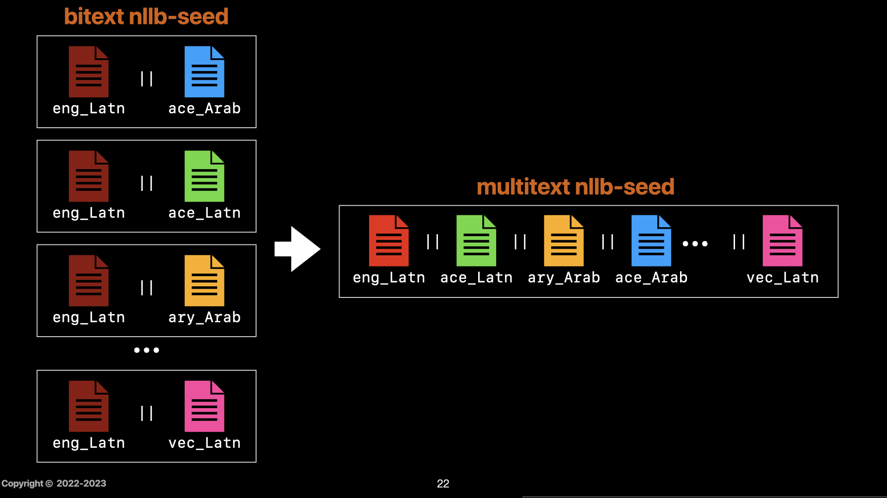

# multi-text nllb-seed
This package provides a multi-text version of the original [bi-text nllb-seed dataset](https://github.com/facebookresearch/flores/blob/main/nllb_seed/README.md). It contains:
- a manually edited consensus [eng_Latn](data/Multitext-NLLB-Seed/eng_Latn) reference file,
- [order_files](data/Multitext-NLLB-Seed/order_files) matching the lines of each original data and the new eng_Latn reference,
    - (minimizing the edit distance between matched pairs)
- [re-ordered](data/Multitext-NLLB-Seed/re_ordered) bitext data files,
- and the resulting [multitext](data/Multitext-NLLB-Seed/multitext/) nllb-seed dataset.

## Ackowledgement
- Moussa Koulako Bala Doumbouya
- Abdoulaye Sow
- Christopher D Manning

## Ackowledgement
This work was done as part of a project supported by N'ko USA Inc., Friasoft, Meta Platforms, Inc. and Stanford University.

## License
 This work is licensed under a <a rel="license" href="http://creativecommons.org/licenses/by-sa/4.0/">Creative Commons Attribution-ShareAlike 4.0 International License</a>.
